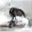
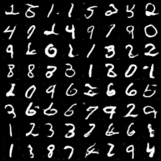

## Pytorch code for GAN models
This is the pytorch implementation of 3 different GAN models using same convolutional architecture.


- DCGAN (Deep convolutional GAN)
- WGAN-CP (Wasserstein GAN using weight clipping)
- WGAN-GP (Wasserstein GAN using gradient penalty)


## Dependecies
The prominent packages are:

* numpy
* scikit-learn
* tensorflow 2.5.0
* pytorch 1.8.1
* torchvision 0.9.1

To install all the dependencies quickly and easily you should use __pip__

```python
pip install -r requirements.txt
```


 *Training*
 ---
Running training of DCGAN model on Fashion-MNIST dataset:


```
python main.py --model DCGAN \
               --is_train True \
               --download True \
               --dataroot datasets/fashion-mnist \
               --dataset fashion-mnist \
               --epochs 30 \
               --cuda True \
               --batch_size 64
```

Running training of WGAN-GP model on CIFAR-10 dataset:

```
python main.py --model WGAN-GP \
               --is_train True \
               --download True \
               --dataroot datasets/cifar \
               --dataset cifar \
               --generator_iters 40000 \
               --cuda True \
               --batch_size 64
```


*Results*
---

*Generated examples MNIST, CIFAR-10*
---





